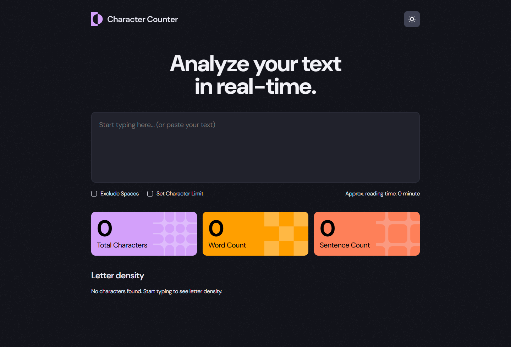

# Frontend Mentor - Character counter solution

This is a solution to the [Character counter challenge on Frontend Mentor](https://www.frontendmentor.io/challenges/character-counter-znSgeWs_i6). Frontend Mentor challenges help you improve your coding skills by building realistic projects. 

## Table of contents

- [Overview](#overview)
  - [The challenge](#the-challenge)
  - [Screenshot](#screenshot)
  - [Links](#links)
- [My process](#my-process)
  - [Built with](#built-with)
  - [What I learned](#what-i-learned)
  - [Continued development](#continued-development)
- [Author](#author)

## Overview

### The challenge

Users should be able to:

- Analyze the character, word, and sentence counts for their text
- Exclude/Include spaces in their character count
- Set a character limit
- Receive a warning message if their text exceeds their character limit
- See the approximate reading time of their text
- Analyze the letter density of their text
- Select their color theme
- View the optimal layout for the interface depending on their device's screen size
- See hover and focus states for all interactive elements on the page

### Screenshot

### Links

- Solution URL: [Link](https://github.com/RicardoGeada/fm-character-counter)
- Live Site URL: [Link](https://character-counter.ricardogeada.com/)

## My process

### Built with

- [React](https://reactjs.org/) - JS library
- TypeScript
- SCSS
- Jest
- JSDoc

### What I learned

In this project, I deepened my understanding of React, particularly how to use React with TypeScript and SCSS for better type safety and styling. I learned how to write tests using Jest to ensure the reliability of the application, and how to document my code with JSDoc for better maintainability. Additionally, I gained experience in implementing a light and dark mode feature, improving the user experience and accessibility.

### Continued development

I would like to continue working with React and deepen my knowledge of it. Additionally, I aim to further improve my testing skills and expand my understanding of accessibility to build more inclusive applications.

## Author

- Website - [ricardogeada.com](https://www.ricardogeada.com)
- Frontend Mentor - [@RicardoGeada](https://www.frontendmentor.io/profile/RicardoGeada)

